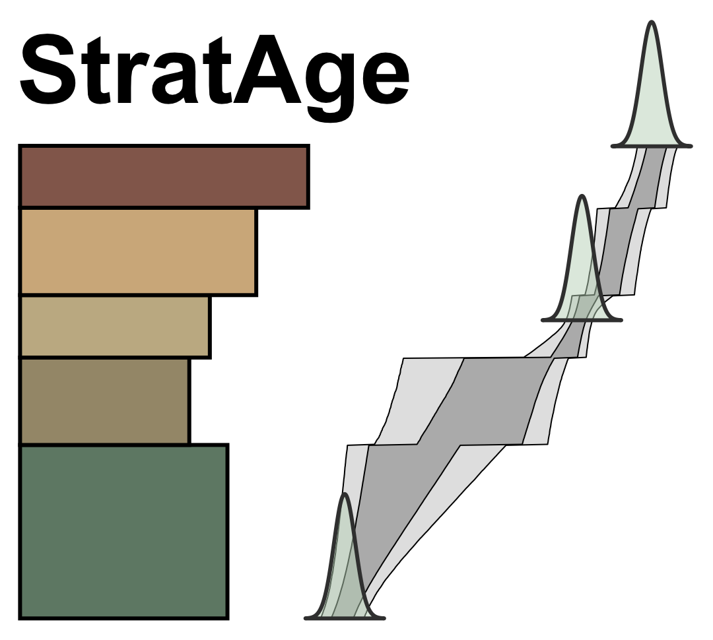

StratAge presents a novel approach to age-depth modeling of geologic stratigraphy. By modeling the distribution of time *within* beds as sedimentation rates and *between* beds as hiatuses, StratAge can leverage the structure of stratigraphy to inform the distribution of time within it.

StratAge uses Markov Chain Monte Carlo sampling to estimate posterior distributions of sedimentation rates and hiatus durations within a user-provided stratigraphy, given probabilistic geochronologic constraints. These model parameters can then be anchored in absolute time to yield a Bayesian age-depth model.

## Installation

StratAge can be installed from `pip`:

```bash
pip install stratage
```

Alternatively, use `conda`:
```bash
conda install conda-forge::stratage
```

## Usage

The best way to get a feel for StratAge is to read through the [Toy Example](https://adrian.tasistro-hart.com/stratage/toy-example.html), which presents the basic functionality of StratAge on a synthetic stratigraphy.